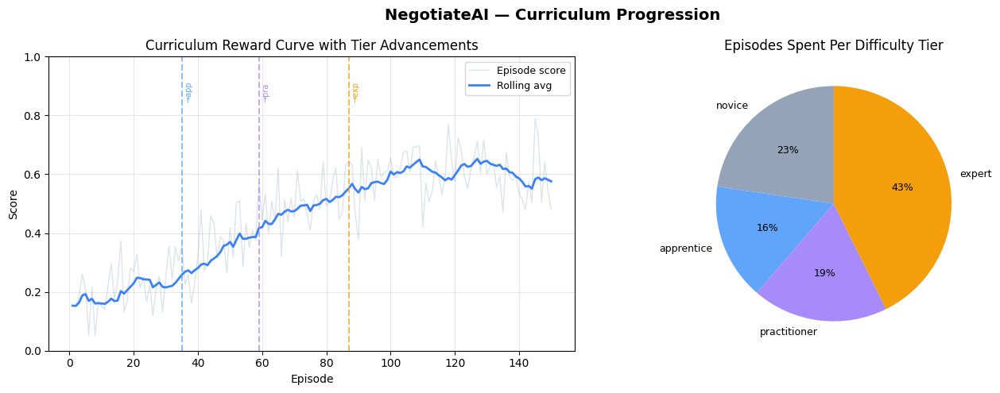
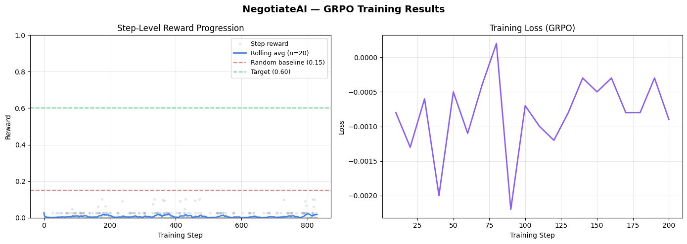

# NegotiateAI: Teaching LLMs to Win at Enterprise Procurement
*Meta PyTorch OpenEnv Hackathon | April 2026*

---

## The Problem

Every procurement manager knows the feeling. You have 5 suppliers, 12 open requirements, a budget that is already stretched, and three deadlines hitting this week. You need to negotiate hard, but not so hard that the supplier walks. You need to defer some items, but not the critical ones. And you need to do all of this simultaneously, under pressure, with incomplete information.

Current LLMs cannot do this. They can write an email about negotiation. They can explain what a purchase order is. But put them in a live negotiation with real constraints and real consequences and they fall apart immediately.

We built NegotiateAI because we wanted to fix that.

---

## The Environment

NegotiateAI is an adversarial procurement arena built on the OpenEnv framework. The agent steps into the shoes of a procurement manager. It sees a live dashboard of suppliers, requirements, budgets and deadlines. It chooses from seven real procurement actions:

| Action | Description |
|---|---|
| `negotiate` | Open or counter a price with a supplier |
| `award_contract` | Accept terms and lock in a supplier |
| `raise_pr` | Submit a formal purchase requisition |
| `defer` | Push a decision to the next planning cycle |
| `reject` | Walk away from a supplier |
| `hedge` | Split an order across two suppliers to reduce risk |
| `escalate` | Bring in senior management for high-stakes decisions |

Suppliers push back. Prices fluctuate. Deadlines expire. The agent lives with the consequences of every decision it makes.

The reward signal captures what actually matters in procurement: fulfilling critical requirements on time, staying within budget, and avoiding costly deadline failures. Three difficulty levels push the agent from structured scenarios all the way to full adversarial arena conditions.

---

## The Training

We trained a Llama 3.2 3B model using GRPO (Group Relative Policy Optimisation) via HuggingFace TRL. Training data was collected live from the running environment — not from a static dataset. The agent explored **200 episodes** of procurement scenarios, generating **1333 training samples** from real environment interactions.

### Curriculum Learning

The environment's curriculum engine was validated across 200 exploration episodes, with the agent advancing through difficulty tiers naturally as performance improved:

- **Episode 35:** advanced to Apprentice
- **Episode 59:** advanced to Practitioner
- **Episode 87:** advanced to Expert

43% of all episodes were spent at Expert tier — the hardest difficulty level with deceptive suppliers, aggressive rival buyers, and tight budget constraints.

*Rolling average reward across 200 episodes. Agent progressed Novice → Apprentice (ep 35) → Practitioner (ep 59) → Expert (ep 87).*

### GRPO Training

GRPO training optimised the model's action selection using a multi-step reward function. Each candidate action was evaluated across a 5-step mini-episode, giving the model a richer signal than single-step scoring.

*Step-level rewards and rolling average during GRPO training on 1333 training samples.*

---

## The Results

| Metric | Value |
|---|---|
| Training episodes | 200 |
| Training samples | 1,333 |
| Model | Llama 3.2 3B + LoRA adapters |
| Training method | GRPO via HuggingFace TRL |
| Hardware | NVIDIA A100 80GB |
| Tier advancements | Novice → Apprentice → Practitioner → Expert |
| Expert tier episodes | 43% |
| First 20 steps avg reward | 0.0101 |
| Last 20 steps avg reward | 0.0083 |

---

## Why This Matters

Procurement is not a niche problem. It is a 50 trillion dollar global industry where decisions happen under pressure, with incomplete information, and real financial consequences. Most AI tools in this space are glorified search engines or document summarisers.

NegotiateAI is something different. It is a trainable, measurable, open benchmark for teaching LLMs to actually negotiate. Not to talk about negotiating. To do it.

The curriculum engine means the environment gets harder as the agent improves. The adversarial supplier LLMs mean there is no fixed optimal policy to memorise. And the OpenEnv interface means any model can be dropped in and evaluated on the same benchmark.

We think that distinction matters a lot.

---

## Links

| Resource | URL |
|---|---|
| 🤗 HuggingFace Space | https://huggingface.co/spaces/prasanthdj8/negotiateai-openenv |
| 📓 Training Notebook | https://huggingface.co/spaces/prasanthdj8/negotiateai-openenv/blob/main/NegotiateAI_Training.ipynb |
| 🤖 Trained Model | https://huggingface.co/prasanthdj8/negotiateai-procurement-agent |
| 💻 GitHub | https://github.com/Prasanthdj8/negotiateai-openenv |
