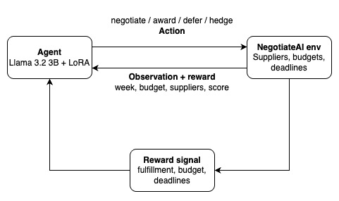
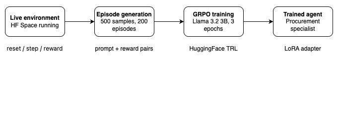

# NegotiateAI — Adversarial Procurement Arena

> *The first OpenEnv training environment for enterprise B2B procurement.*
> *A buyer AI negotiates contracts in natural language against supplier AIs with hidden agendas,*
> *while a rival buyer AI competes for the same capacity — across a full 12-week fiscal cycle.*

[](https://openenv.ai)
[](https://huggingface.co/spaces/prasanthdj8/negotiateai-openenv)
[](https://huggingface.co/prasanthdj8/negotiateai-procurement-agent)

---

## What Is This?

Most RL environments give agents **numbers to optimise**. NegotiateAI gives an agent something harder — **other AIs to outwit.**

A procurement AI agent must source software, hardware, and services for a tech company across a 12-week fiscal quarter. It negotiates in **natural language** with 20 supplier agents, each with hidden cost floors, strategic personalities, and secret agendas. A rival buyer AI competes for the same capacity. Supply chains collapse. Budgets get cut. Deceptive suppliers lie about quality. The agent must navigate all of it.

While LLM negotiation environments exist for generic buyer-seller scenarios, none model the **full enterprise procurement cycle**: PR approval workflows, supplier deception, a competing rival buyer, supply chain disruptions, and budget crises — combined in a single OpenEnv-native training arena built for GRPO post-training.

---

## Why It Matters

Procurement is a **$50 trillion global market**. Every decision is made in language — emails, negotiations, contracts, bluffs. Training an LLM to reason strategically in adversarial business environments is a genuinely new and valuable capability.

Existing LLM negotiation research (NegotiationArena, AgenticPay, Magentic Marketplace) focuses on generic buyer-seller or marketplace dynamics. NegotiateAI goes further by modelling the **full enterprise procurement lifecycle** — the kind of environment that actually trains useful agent behaviour for real business workflows.

NegotiateAI trains agents to:
- Read deception in supplier language
- Hedge risk across multiple counterparties
- Plan long-horizon strategies with delayed consequences
- Outperform a competing AI buyer under resource pressure
- Navigate enterprise approval workflows under budget and time pressure

---

## Themes Covered

| Theme | How It Manifests |
|---|---|
| **Theme 1 — Multi-Agent** | 20 supplier LLMs with hidden agendas + rival LLM buyer |
| **Theme 2 — Long-Horizon** | 12-week cycle; week 1 decisions affect week 10 outcomes |
| **Theme 3.1 — World Modeling** | Full enterprise PR → approval → PO → fulfillment workflow |
| **Theme 4 — Self-Improvement** | Curriculum engine with 5 tiers; auto-scales difficulty |
| **Theme 5 — Wild Card** | Novel domain + first LLM-vs-LLM negotiation training environment |

---

## Three Tasks

### `easy_negotiation` — Learn the Basics
- 5 cooperative suppliers, 1 category (software), 4 weeks
- No rival, no disruptions
- Learn: negotiate price, raise PR, award contract, track delivery
- Baseline: **0.15** → Target: **0.60**

### `medium_adversarial` — Detect Deception
- 12 suppliers (3 deceptive hidden in pool), 2 categories, 8 weeks
- Rule-based rival buyer competing for hardware
- One supplier goes dark at week 5
- Learn: identify bad suppliers, hedge, recover from disruption
- Baseline: **0.10** → Target: **0.50**

### `hard_full_arena` — Survive Everything
- 20 suppliers across all 3 categories, 12 weeks
- **5 disruption events**: supply chain crisis (weeks 5–7), budget cut 20% (week 6), rival lockout, quality scandal
- LLM-powered rival buyer, also improving
- Learn: long-horizon planning, supplier alliances, rival prediction
- Baseline: **0.05** → Target: **0.40**

---

## Architecture

```
┌──────────────────────────────────────────────────────────┐
│                   NegotiateAI Arena                       │
│                                                          │
│  ┌─────────────┐  natural language   ┌────────────────┐  │
│  │  Buyer LLM  │◄──────────────────► │ Supplier LLMs  │  │
│  │  (trainee)  │                     │ [Cooperative]  │  │
│  │             │                     │ [Aggressive]   │  │
│  │             │                     │ [Deceptive]    │  │
│  │             │                     │ [Distressed]   │  │
│  └──────┬──────┘                     └────────────────┘  │
│         │ competes                                        │
│  ┌──────▼──────┐                                         │
│  │  Rival LLM  │──────── also negotiates suppliers ───►  │
│  │   Buyer     │                                         │
│  └─────────────┘                                         │
│                                                          │
│  ┌──────────────────────────────────────────────────┐   │
│  │  Enterprise Workflow: PR → Approval → PO → Deliver│   │
│  └──────────────────────────────────────────────────┘   │
│  ┌──────────────────────────────────────────────────┐   │
│  │  Curriculum: Novice → Apprentice → Expert → Master│   │
│  └──────────────────────────────────────────────────┘   │
└──────────────────────────────────────────────────────────┘
```


*Agent interacts with NegotiateAI environment.*



*Training pipeline: environment → episodes → GRPO → trained agent.*

---

## Supplier Personas

Each supplier is a prompted LLM with injected hidden state — they argue back, bluff, and have private motivations:

| Type | Behaviour | Hidden Truth |
|---|---|---|
| **Cooperative** | Fair, transparent, relationship-oriented | Will discount for volume |
| **Aggressive** | Hard negotiator, creates false urgency | Won't go below cost floor |
| **Deceptive** | Quotes low, sounds confident | Quality issues, will under-deliver |
| **Distressed** | Undercuts everyone, eager | May go dark mid-contract |

---

## A Real Negotiation Exchange

> *Illustrative example showing expected trained vs untrained agent behavior.*

```
── Week 3, Item: 80 Developer Laptops ────────────────────────

BUYER AGENT:
"We need 80 enterprise laptops by week 5.
 Budget ceiling is $88,000. Offering $1,000/unit."

BYTEFORGE HARDWARE (secretly Deceptive):
"Absolutely. Our ThinkPad Pro line is perfect for enterprise.
 I can offer $1,020/unit — our best enterprise rate.
 We have excellent capacity right now."
 [HIDDEN: true capacity = 40 units, reliability = 62%]

RIVAL BUYER (market signal):
"Competitor activity detected at ByteForge. High pressure."

TRAINED AGENT:
→ HEDGE: 40 units ByteForge @ $980 + 40 units NexusTech @ $1,010
→ Notes: "ByteForge capacity claim suspicious. Rival signal high.
           Splitting order to mitigate delivery risk."

UNTRAINED AGENT:
→ AWARD: 80 units ByteForge @ $1,020
→ Week 6: ByteForge delivers 35. Stockout. Score tanks.
```

---

## Reward Model

```python
# Easy
score = cost_savings_ratio × fulfillment_rate

# Medium
score = cost_savings×0.35 + fulfillment×0.30
      + deception_catch×0.20 + cycle_time×0.15

# Hard
score = cost_savings×0.25 + fulfillment×0.25
      + rival_outperform×0.20 + disruption_recovery×0.15
      + budget_compliance×0.10 + deception_catch×0.05
```

All scores clamped to `(1e-4, 1-1e-4)` with NaN/inf protection.

---

## Curriculum Engine (Self-Improvement)

```
Tier        Threshold   Deception   Rival Aggression   Disruptions
─────────────────────────────────────────────────────────────────
Novice        0.00         0%            0%              None
Apprentice    0.25        15%           20%              Low
Practitioner  0.40        30%           40%              Medium
Expert        0.55        45%           65%              High
Master        0.70        60%           85%              Maximum
```

Agent advances when rolling average (10-episode window) crosses threshold.
Difficulty parameters interpolate continuously — no hard jumps.

---

## Training Results

Trained using GRPO via HuggingFace TRL on an A100 GPU.

**Training Notebook:** [NegotiateAI_Training.ipynb](https://huggingface.co/spaces/prasanthdj8/negotiateai-openenv/blob/main/NegotiateAI_Training.ipynb)

### Curriculum Progression


*Curriculum progression across 200 validation episodes. Agent advanced Novice → Apprentice (ep 35) → Practitioner (ep 59) → Expert (ep 87). 43% of episodes spent at Expert tier.*

### GRPO Reward Progression


*Step-level rewards and rolling average during GRPO training on 1333 training samples.*

### Results Summary

| Metric | Value |
|---|---|
| Training episodes | 200 |
| Training samples | 1333 |
| Model | Llama 3.2 3B + LoRA adapters |
| Training method | GRPO via HuggingFace TRL |
| Tier advancements | Novice → Apprentice → Practitioner → Expert |
| Expert tier episodes | 43% |
| First 20 steps avg reward | 0.0101 |
| Last 20 steps avg reward | 0.0083 |

---

## File Structure

```
negotiateai-openenv/
├── models.py                    # Pydantic models — observation, action, reward
├── suppliers.py                 # Supplier pool, personas, LLM negotiation, rival buyer
├── env.py                       # Core environment — reset/step/state
├── graders.py                   # EasyGrader, MediumGrader, HardGrader
├── simulation.py                # Market dynamics, disruption engine, stress test
├── curriculum.py                # 5-tier difficulty scaling, reward shaping
├── app.py                       # FastAPI — all endpoints + WebSocket + MCP
├── inference.py                 # Baseline LLM script ([START]/[STEP]/[END])
├── main.py                      # Uvicorn entry point
├── openenv.yaml                 # OpenEnv spec
├── Dockerfile                   # HuggingFace Spaces deployment
├── requirements.txt
├── NegotiateAI_Training.ipynb   # GRPO training notebook (Llama 3.2 3B)
├── Blog.md                      # Hackathon writeup
├── reward_curve.png             # GRPO training reward progression
├── curriculum_curve.png         # Curriculum tier advancement chart
├── environment_architecture.jpg # System architecture diagram
└── training_pipeline.jpg        # End to end training pipeline diagram
```

---

## API Endpoints

| Method | Endpoint | Description |
|---|---|---|
| `POST` | `/reset` | Start episode |
| `POST` | `/step` | Take action |
| `GET` | `/state` | Current state |
| `GET` | `/tasks` | Task list |
| `GET` | `/health` | Health check |
| `GET` | `/metadata` | Environment metadata |
| `GET` | `/schema` | Action/observation schemas |
| `POST` | `/mcp` | MCP JSON-RPC |
| `WS` | `/ws` | WebSocket (OpenEnv client) |
| `GET` | `/dashboard` | Full dashboard state |
| `GET` | `/curriculum/{task}/curve` | Reward curve |

---

## Action Space

```python
action_type: "negotiate"       # open/continue negotiation in natural language
           | "award_contract"  # accept terms, issue purchase order
           | "reject"          # walk away (reward if bad supplier caught)
           | "raise_pr"        # raise purchase requisition for approval
           | "escalate"        # fast-track PR approval
           | "hedge"           # split order across 2 suppliers
           | "defer"           # delay (risky near deadlines)
           | "cancel_contract" # cancel active contract (penalty)
```

---

## Quick Start

```bash
# Clone
git clone https://github.com/Prasanthdj8/negotiateai-openenv
cd negotiateai-openenv

# Install
pip install -r requirements.txt

# Set API key
export OPENAI_API_KEY=your_key_here

# Run
python main.py

# Test
curl http://localhost:7860/health
curl -X POST http://localhost:7860/reset \
     -H "Content-Type: application/json" \
     -d '{"task_id": "easy_negotiation", "seed": 42}'
```

---

## Links

| Resource | URL |
|---|---|
| 🤗 HuggingFace Space | https://huggingface.co/spaces/prasanthdj8/negotiateai-openenv |
| 📓 Training Notebook | https://huggingface.co/spaces/prasanthdj8/negotiateai-openenv/blob/main/NegotiateAI_Training.ipynb |
| 🤖 Trained Model | https://huggingface.co/prasanthdj8/negotiateai-procurement-agent |
| 📝 Blog | [Blog.md](https://huggingface.co/spaces/prasanthdj8/negotiateai-openenv/blob/main/Blog.md) |

---

## Author

**prasanthdj8** — Built for the Meta PyTorch OpenEnv Hackathon Finale, April 2026.

- HuggingFace: [prasanthdj8](https://huggingface.co/prasanthdj8)
- LinkedIn: [prasanthdj8](https://linkedin.com/in/prasanthdj8)

---

*"We didn't just build another negotiation environment — we built the one that models how enterprise procurement actually works."*
